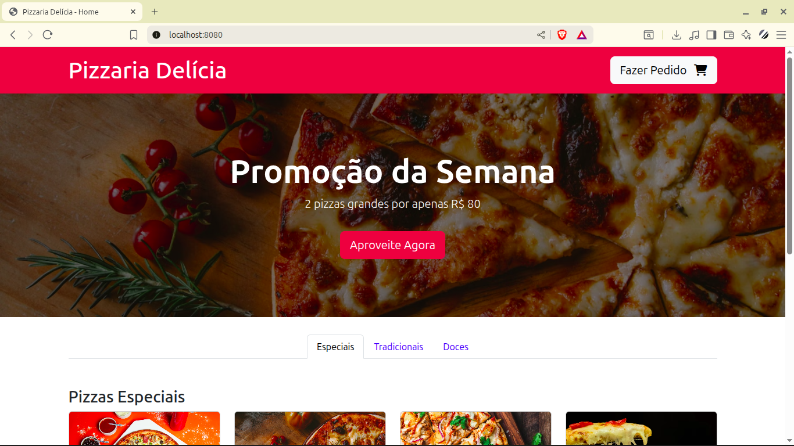
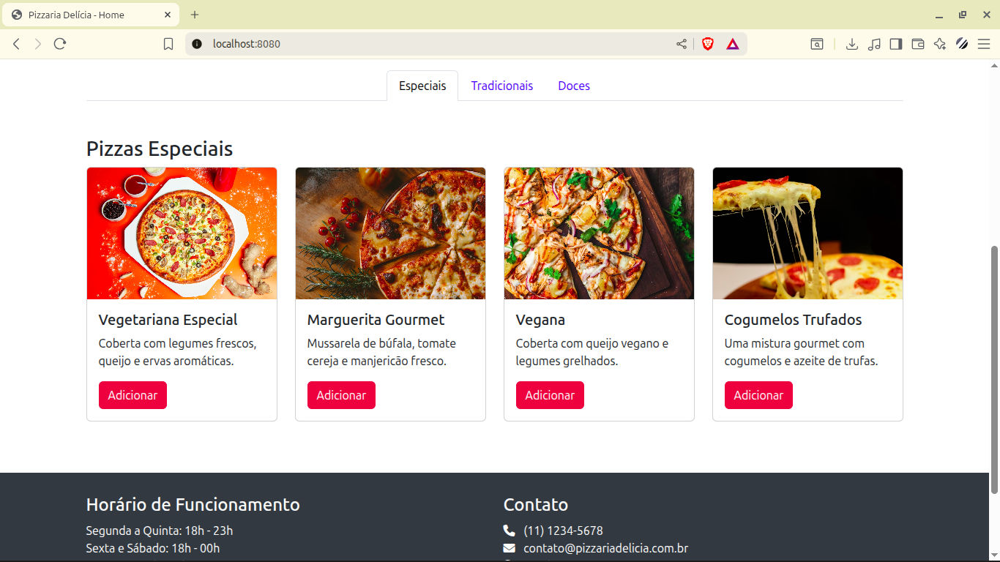
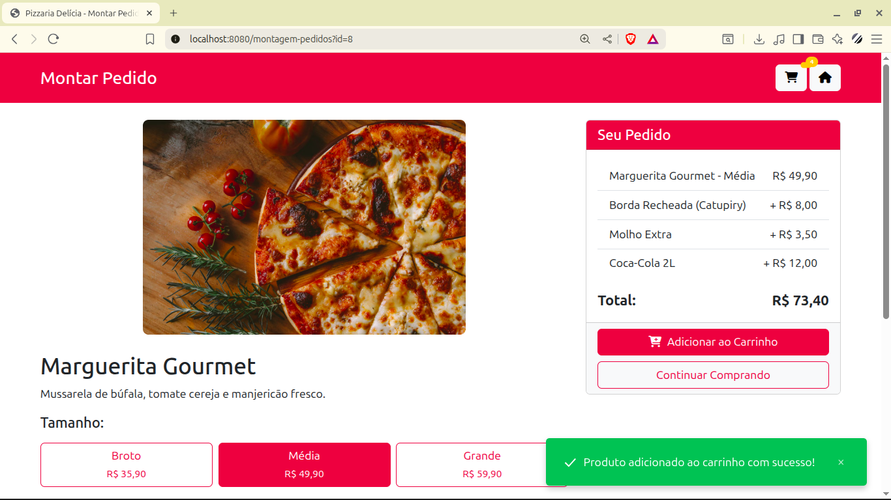
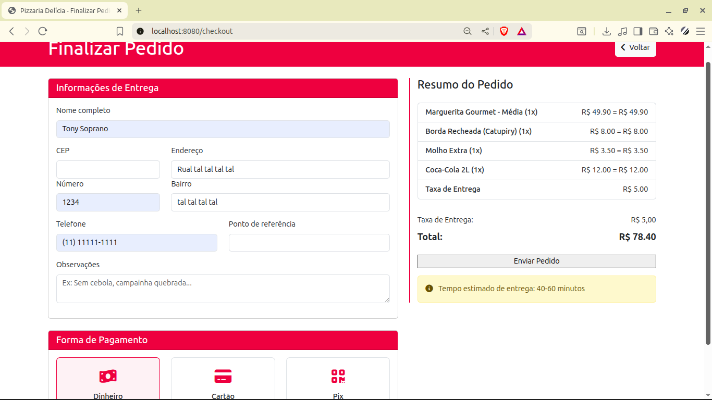
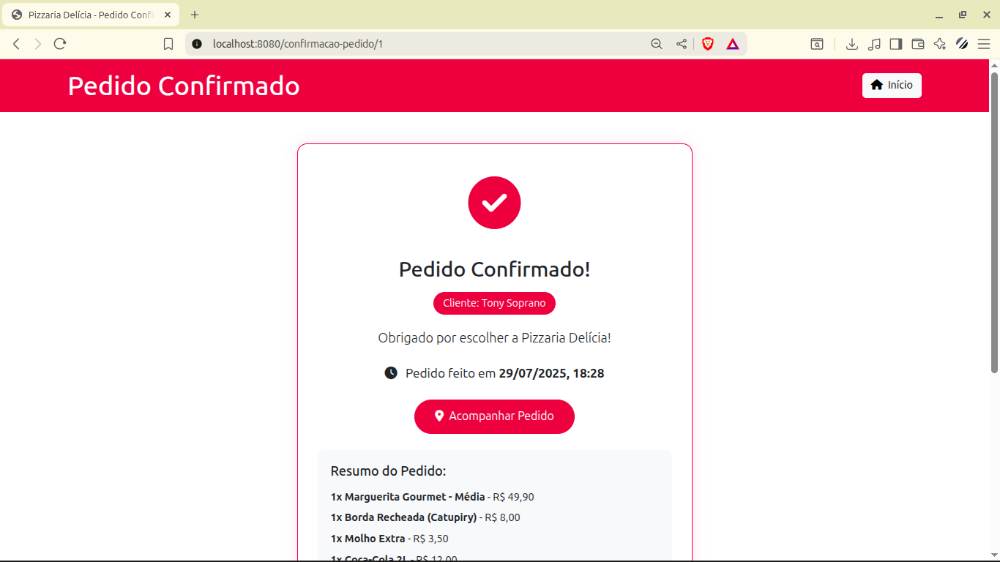
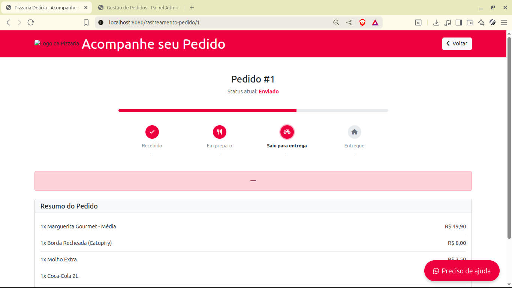
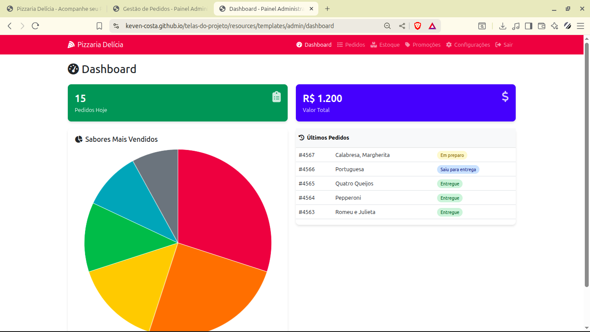
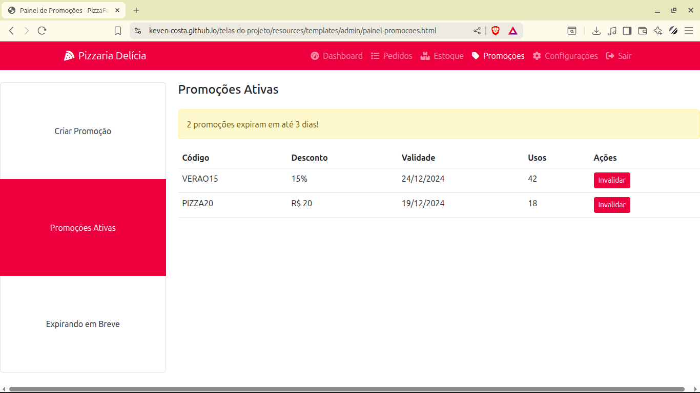

# Sistema de Gestão para Pizzaria 🍕

 
 


Projeto pessoal desenvolvido para fins de aprendizagem, implementando um sistema  para pizzaria com:


- **Área Pública**: Para clientes montarem e acompanharem pedidos
- **Área Administrativa**: Com autenticação para gestão do negócio
- **Stack**: Java, Spring Boot, MySQL, Thymeleaf e Docker


*Observação: Projeto desenvolvido para fins de aprendizagem, algumas funcionalidades podem ser limitadas.*

## 📌 Índice

- [Tecnologias Utilizadas](#tecnologias-utilizadas)
- [Funcionalidades Implementadas](#funcionalidades-implementadas)
- [Estrutura de Rotas](#estrutura-de-rotas)
- [Acesso Administrativo](#acesso-administrativo)
- [Pré-requisitos](#pre-requisitos)
- [Execução](#execucao)
- [Diagramas](#diagramas)
- [Principais Problemas](#principais-problemas)
- [Imagens e Visualização das telas](#imagens-projeto)


## <a id="tecnologias-utilizadas"></a> 🛠️ Tecnologias Utilizadas


| Camada         | Tecnologias                              |
|----------------|------------------------------------------|
| Backend        | Java 11, Spring Boot 2.7, Spring Security|
| Banco de Dados | MySQL 8.0                                |
| Frontend       | Thymeleaf, Bootstrap 5                   |
| Infra          | Docker, Docker Compose                   |

## <a id="funcionalidades-implementadas"></a> 🎯 Funcionalidades Implementadas

### Área do Cliente
- ✔️ Montagem interativa de pedidos
- ✔️ Checkout simplificado
- ✔️ Rastreamento do pedido

### Área Administrativa
- ✔️ Dashboard 
- ✔️ Gestão de pedidos
- ✔️ Gestão de estoque de ingredientes
- ✔️ Gerenciamento de cardápio
- ✔️ Autenticação segura (Spring Security)

## <a id="estrutura-de-rotas"></a> 🗺️ Estrutura de Rotas

### Cliente (Acesso Livre)
| Rota                          | Descrição                     |
|-------------------------------|-------------------------------|
| `/`                           | Página inicial                |
| `/montagem-pedidos?id={id}`   | Personalização do pedido      |
| `/checkout`                   | Finalização da compra         |
| `/confirmacao-pedido/{id}`    | Confirmação do pedido         |
| `/rastreamento-pedido/{id}`   | Acompanhamento do pedido      |

### Administração (Protegido)
| Rota                          | Descrição                     |
|-------------------------------|-------------------------------|
| `/admin/login`                | Página de autenticação        |
| `/admin/dashboard`            | Visão geral da operação       |
| `/admin/gestao-pedidos`       | Gerenciamento de pedidos      |
| `/admin/gestao-ingredientes`  | Controle de estoque           |
| `/admin/painel-promocoes`     | Gestão de promoções           |
| `/admin/gerenciar-pizzas`     | Administração do cardápio     |

## <a id="acesso-administrativo"></a> 🔐 Acesso Administrativo

Para acessar a área administrativa:

1. Acesse: http://localhost:8080/admin/login
2. Credenciais padrão:

- Usuário: ```admin```  
- Senha: ```123456```


## <a id="pre-requisitos"></a> ⚙️ Pré-requisitos

| Componente       | Versão mínima | Como verificar       |
|------------------|---------------|----------------------|
| Docker           | 20.10+        | `docker --version`   |
| Docker Compose   | 1.29+         | `docker-compose -v`  |


##   <a id="execucao"></a> ▶️ Execução

*Rodando a aplicação com Docker*

### 1. Clone o repositório

Primeiro, clone este repositório para a sua máquina:

```bash
git clone https://github.com/[seu-usuario]/gestao-pizzaria.git

```
Navegue até a raiz do projeto
```bash
cd gestao-pizzaria
```

### 2. Crie um arquivo .env
Crie um arquivo `.env` na raiz do projeto

#### No Windows (CMD ou PowerShell):

No CMD:

```bash
type nul > .env
```

No PowerShell:

```bash
New-Item -Path .env -ItemType File
```


#### No Linux:

```bash
touch .env
```

Adicione as seguintes variáveis de ambiente com suas credenciais:

``` 
DB_USERNAME=usuario_projeto
DB_PASSWORD=senha_projeto
DB_ROOT_PASSWORD=senha_root_mysql
```

- Você pode substituir os valores **usuario_projeto**, **senha_projeto**, **senha_root_mysql** pelas suas credenciais reais.

### 3. Verifique se o doker esta rodando
Caso não esteja iniciado:

- Linux: ```sudo systemctl start docker```

- Windows/Mac: Inicie o Docker Desktop

### 4. Construa e execute os containers

```bash
docker compose up --build
```

### 5. Acessando a aplicação
Após a execução do comando acima, a aplicação estará rodando em http://localhost:8080.

## Rodar a aplicação como desenvolvedor

→[Acesse aqui](https://github.com/Keven-Costa/sistema-de-gestao-para-pizzaria/blob/main/README-DEV.md)

##  <a id="diagramas"></a> 📊 Diagramas
→ [Ver diagramas do projeto](https://github.com/Keven-Costa/sistema-de-gestao-para-pizzaria/blob/main/diagramas.md)


## <a id="principais-problemas"></a> 🔍 Principais Problemas 

O projeto resolve esses problemas

<details>
  <summary><strong>1. Pedidos feitos por telefone/WhatsApp geram erros no registro</strong></summary>
  
  **Situação atual**: Os pedidos são anotados manualmente por atendentes via telefone ou WhatsApp.  
  **Exemplo**: O atendente entende "frango com cheddar" como "frango com catupiry" e registra o pedido errado, gerando insatisfação no cliente.  
  **Solução**: O sistema permite que o próprio cliente monte seu pedido com todos os detalhes (sabores, adicionais, endereço), reduzindo erros de interpretação.
</details>

<details>
  <summary><strong>2. Dificuldade em rastrear o status das entregas</strong></summary>
  
  **Situação atual**: O cliente precisa ligar ou mandar mensagem para saber se o pedido já saiu ou foi entregue.  
  **Exemplo**: Um cliente liga 3 vezes perguntando se o motoboy já saiu, e o atendente precisa verificar manualmente com a cozinha.  
  **Solução**: O sistema exibe o status do pedido em tempo real (ex: "em preparo", "saiu para entrega", "entregue"), acessível pelo próprio cliente.
</details>

<details>
  <summary><strong>3. Controle manual de estoque de ingredientes</strong></summary>
  
  **Situação atual**: A quantidade de ingredientes é controlada em planilhas ou cadernos.
 
  **Solução**: O sistema exibi o status do ingrediente
</details>

<details>
  <summary><strong>4. Dificuldade em gerenciar promoções e descontos</strong></summary>
  
  **Situação atual**: Promoções são anunciadas apenas no WhatsApp ou em panfletos, sem integração com o sistema.  
  **Exemplo**: Um cliente tenta usar um cupom de "10% OFF" que já expirou, mas o atendente não tem como verificar.  
  **Solução**: Sistema integrado com validação automática de cupons e aplicação de descontos.
</details>

<details>
  <summary><strong>5. Ausência de relatórios para gestão</strong></summary>
  
  **Situação atual**: Gerente não sabe quais sabores mais saem ou quanto vende por dia.  
  **Problema**: Dificuldade em tomar decisões baseadas em dados.  
  **Solução**: Relatórios automáticos de vendas, ingredientes mais usados e desempenho financeiro.
</details>

<details>
  <summary><strong>6. Gestão do cardápio</strong></summary>
  
  **Solução**: Atualização centralizada do cardápio com fotos, preços e disponibilidade em tempo real.
</details>

## 📷 Imagens e Visualização das telas <a id="imagens-projeto"></a>

→[Repositório para visualização das telas](https://github.com/Keven-Costa/telas-do-projeto)








